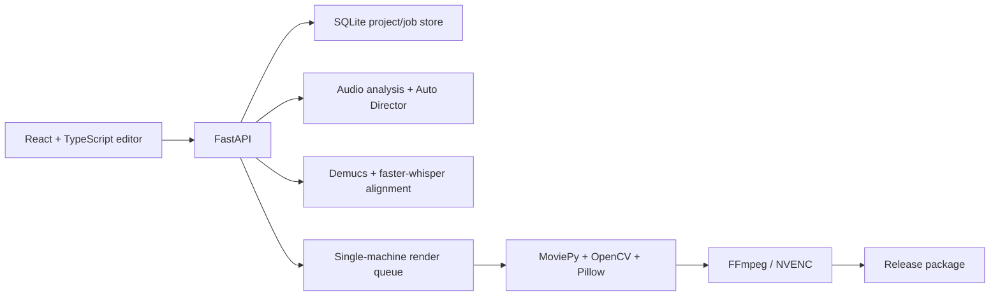

# Pulse Studio

**Turn a finished song into a complete lyric-video release package — locally, automatically, and with GPU acceleration.**

Pulse Studio Community Edition is a source-available, local-first web application for musicians and creators who need to publish songs on YouTube, TikTok, Instagram Reels, and YouTube Shorts without rebuilding the same video by hand for every platform.

Upload a song, cover artwork, and optional TXT/SRT lyrics. Pulse Studio analyzes the music, aligns supplied lyrics to the vocal performance, opens a real-time visual editor, and exports every selected format together with subtitles, thumbnail, captions, metadata, and a quality report.

> Project status: **Community Edition v0.1.0 Alpha**. The application is usable end to end, but project and preset formats may evolve before v1.0.

Before installing, review the [known limitations](KNOWN_LIMITATIONS.md) for this alpha.

## Why Pulse Studio?

AI music tools make creating a song fast. Publishing it is still fragmented: mastering assets, lyric timing, vertical edits, YouTube versions, subtitles, thumbnails, captions, and platform-safe layouts all require repetitive work.

Pulse Studio focuses on that gap. It is not a general-purpose video editor. It is an automated release workflow designed specifically for songs.

## Highlights

- Local-first processing with no paid API or mandatory cloud upload
- React web interface backed by FastAPI
- NVIDIA CUDA, NVENC, FFmpeg, MoviePy, OpenCV, and Pillow rendering
- BPM, beat, downbeat, energy, and musical-section analysis with librosa
- TXT lyric alignment using Demucs vocal separation and faster-whisper `large-v3`
- Language selection for English, Italian, Spanish, French, German, Portuguese, Dutch, Polish, Turkish, Russian, Japanese, Korean, Chinese, or automatic detection
- Word-level timing, karaoke highlighting, and editable line boundaries
- Real audio spectrum visualizers: Bars, Wave, and Ring
- Beat-synchronized cover pulse and effects
- Drag-and-drop positioning with magnetic alignment guides
- Independent 16:9 and 9:16 layouts with platform safe areas
- Synchronized image/video backgrounds with repeat, freeze, offset, speed, brightness, saturation, blur, and smart crop
- Persistent custom TTF/OTF font library
- Community-importable `.pulsepreset.json` presets
- Persistent, duplicateable, importable `.pulseproject` projects
- Auto Director suggestions for teaser, chorus, lyric cut, and full-song ranges
- NVENC export with CPU fallback
- Automatic thumbnail, SRT, captions, manifest, QC report, and release ZIP
- Golden-frame and synchronization regression tests

## Export package

Depending on the formats selected in the editor, Pulse Studio can produce:

```text
teaser.mp4                 9:16, custom range
chorus.mp4                 9:16, custom range
lyrics.mp4                 9:16, custom range
youtube.mp4                16:9, custom or full-song range
youtube_thumbnail.jpg
lyrics.srt
social_captions.txt
release_manifest.json
quality_report.json
release_pack.zip
```

All video ranges are editable using `mm:ss` start and end values.

## Architecture



The default render concurrency is one. This avoids VRAM contention and makes long renders predictable on creator workstations.

## Requirements

Recommended configuration:

- Windows 11
- WSL 2
- Docker Desktop using the WSL 2 backend
- Recent NVIDIA Game Ready or Studio driver
- NVIDIA GPU with CUDA and NVENC support
- 16 GB RAM minimum; 32 GB recommended for large models
- Approximately 10–20 GB free disk space for images, models, projects, and temporary renders

CPU rendering is supported, but lyric alignment and full-resolution exports will be considerably slower.

## Quick start on Windows

### 1. Clone the repository

Clone the repository from its GitHub page, then open the project directory:

```powershell
cd pulse-studio
```

### 2. Run diagnostics and start

```powershell
Set-ExecutionPolicy -Scope Process Bypass
.\onboarding.ps1 -Start
```

You can also double-click:

```text
Start Pulse Studio.bat
```

The onboarding script checks Docker, WSL 2, NVIDIA drivers, container GPU access, available disk space, ports, model cache, API health, and NVENC.

### 3. Open Pulse Studio

Visit [http://localhost:8080](http://localhost:8080).

The first TXT alignment downloads the configured Whisper and Demucs model files. Later runs use the persistent local cache.

## Manual Docker start

```powershell
docker compose up --build
```

Run in the background:

```powershell
docker compose up -d --build
```

Stop the application without deleting projects or models:

```powershell
docker compose down
```

Local state is stored in:

```text
data/       projects, database, installed fonts, and outputs
models/     Whisper, Demucs, and Torch model caches
```

Both directories are ignored by Git.

## Workflow

1. Create a project and choose the song, cover, optional TXT/SRT lyrics, and language.
2. Pulse analyzes the audio and aligns TXT lyrics to the isolated vocal performance.
3. Review the result in the live editor and correct any line timing if necessary.
4. Customize the background, cover, visualizer, typography, word animation, shadows, effects, and safe areas.
5. Select export formats and exact song ranges.
6. Export the complete release package using NVENC or the CPU fallback.

### Lyrics input

- **SRT** is used directly and is the fastest option.
- **TXT** remains the authoritative wording. Pulse uses Demucs, Whisper timestamps, vocal activity, and monotonic line mapping to infer line and word timing.

Automatic alignment should always be reviewed for difficult material such as layered vocals, heavy effects, extremely fast rap, improvised ad-libs, or intentionally inaccurate supplied text.

An `lyrics.alignment.json` diagnostic report is generated alongside aligned project lyrics to help investigate uncertain mappings.

## Community presets

Presets are versioned, declarative JSON files. They cannot execute code or contain songs, cover art, lyrics, fonts, or other binary assets.

- [Preset authoring guide](docs/CREATING_PRESETS.md)
- [Preset JSON Schema](schemas/preset-v1.schema.json)
- [Classic Pulse example](presets/classic-pulse.pulsepreset.json)

## Portable projects

Projects can be exported as versioned `.pulseproject` archives and imported on another Pulse Studio installation.

- [Project format specification](docs/PULSEPROJECT.md)
- [Project JSON Schema](schemas/project-v1.schema.json)

## Local development

### Frontend

```powershell
cd frontend
npm ci
npm run dev
```

The Vite development server runs at [http://localhost:5173](http://localhost:5173).

### Backend

Python 3.12 and FFmpeg are recommended.

```powershell
python -m venv .venv
.\.venv\Scripts\Activate.ps1
pip install -r backend\requirements.txt
$env:PYTHONPATH = "backend"
python -m uvicorn app.main:app --reload --port 8000
```

Interactive API documentation is available at [http://localhost:8000/docs](http://localhost:8000/docs).

## Tests

Backend:

```powershell
$env:PYTHONPATH = "backend"
python -m pytest backend\tests
```

Frontend production build:

```powershell
cd frontend
npm ci
npm run build
```

GPU/container test run:

```powershell
docker run --rm --gpus all `
  -w /workspace/backend `
  -v "${PWD}:/workspace" `
  videomaker-web-backend `
  python3 -m pytest -q tests
```

GitHub Actions runs backend tests and the frontend production build for every push and pull request.

## Configuration

Copy `.env.example` to `.env` when overriding defaults. Important variables include:

| Variable | Default | Purpose |
| --- | --- | --- |
| `APP_DATA_DIR` | `/app/data` | Persistent application state |
| `APP_MODELS_DIR` | `/app/models` | AI model cache |
| `APP_WHISPER_MODEL` | `large-v3` | faster-whisper model |
| `APP_RENDER_CONCURRENCY` | `1` | Parallel render jobs |
| `APP_MAX_UPLOAD_MB` | `800` | Maximum upload size |
| `APP_CORS_ORIGINS` | localhost URLs | Allowed frontend origins |

## Security and privacy

Pulse Studio is designed for local use on a trusted workstation. It currently does not provide authentication or multi-user isolation. Keep the default loopback-only Docker bindings and do not expose port 8000 or 8080 to a LAN or the public internet.

Songs, artwork, lyrics, installed fonts, projects, and outputs stay in the local `data/` directory unless you explicitly export or share them.

See [SECURITY.md](SECURITY.md) for vulnerability reporting.

## Roadmap

The v0.1 focus is reliability, installation, alignment quality, and a strong automated release workflow. Candidate post-v0.1 work includes:

- more lyric animation engines and community presets
- waveform timeline and richer timing correction
- smarter vocal-alignment confidence visualization
- optional mastering workflow
- macOS/Linux onboarding improvements
- localization of the user interface

Please use GitHub Discussions for ideas and GitHub Issues for reproducible defects.

## Contributing

Contributions are welcome. Read [CONTRIBUTING.md](CONTRIBUTING.md), follow the [Code of Conduct](CODE_OF_CONDUCT.md), and use the provided issue and pull-request templates.

## License

Pulse Studio Community Edition is licensed under the [PolyForm Perimeter License 1.0.0](LICENSE). You may inspect, use, modify, and share it under those terms, but you may not provide others with a competing product or service based on Pulse Studio.

Generated videos and other ordinary creative output may be used commercially and remain the user's property, subject to rights in their input material. See [Output rights](OUTPUT-RIGHTS.md).

Commercial software licensing is available separately for hosted, white-label, bundled, or competing products. See [Commercial licensing](COMMERCIAL-LICENSE.md) and the [trademark policy](TRADEMARKS.md).

Third-party models, fonts, media, and dependencies retain their own licenses. You are responsible for having the rights to every song, image, video, lyric, and font you process or distribute.
